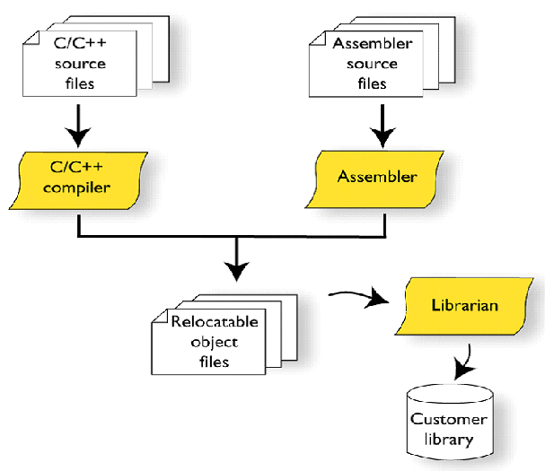
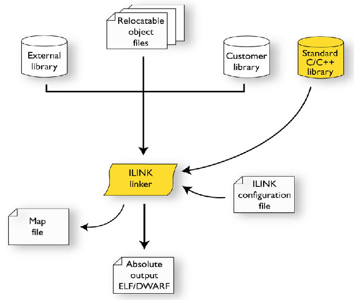
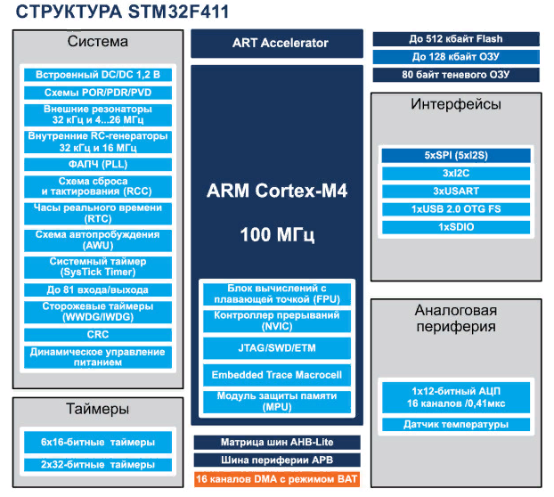
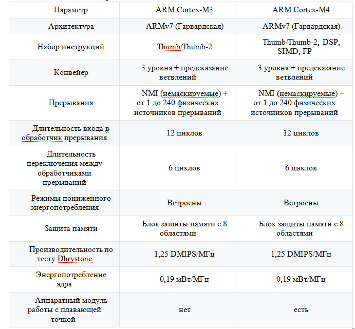

== 1.Что такое POD типы данных?

_Простая структура данных (POD)_ — в современных языках программирования высокого уровня тип данных, 
имеющий жёстко определённое расположение полей в памяти, не требующий ограничения доступа и автоматического управления. 
Переменные такого типа можно копировать простыми процедурами копирования участков памяти наподобие memcpy. 
Противоположность — управляемая структура данных.

== 2.Назовите все типы данных в языке С++

Основные типы данных:

- int (целый);
- char (символьный);
- bool (логический);
- float (вещественный);
- double (вещественный с двойной точностью).

Для уточнения диапазона значений и внутреннего представления стандартных типов применяются спецификаторы типа:

- short (короткий);
- long (длинный);
- signed (знаковый);
- unsigned (беззнаковый).

К основным типам языка С++ относится также тип void. 

== 3.Что такое пользовательский тип?

Пользовательский тип это тип, в котором пользователь определяет новое имя для уже существующего типа. 
При этом сам новый тип данных не создается, а лишь определяется новое имя для уже существующего типа.  
Пользовательским типом будет считаться всё то, что пользователь сделал сам для своего удобства.
Общий формат записи инструкции для создания пользовательского типа:

----
typedef тип новое_имя;
----

== 4.Назовите модификаторы типов

Модификаторы short,  long,  signed и  unsigned могут применяться к целочисленным типам. К символам можно применять signed и unsigned, long может применяться к типу double. 

== 5. Назовите правило установки размеров типов

Различные микроконтроллеры имеют различные размеры типов. 
Для размеров типов существует правило:

----
1             <= sizeof(char)   <= sizeof() <= sizeof(short) <= sizeof(int) <= sizeof(long)
1             <= sizeof(bool)   <= sizeof(long)
sizeof(char)  <= sizeof(long)
sizeof(float  <= sizeof(double)  <= sizeof(long double)
sizeof(T)     == sizeof(signed T) == sizeof(unsigned T)
----

Поэтому вместо прямых типов типа int, используйте псевдонимы, например:

----
std:: uint32_t	целое беззнаковое длиной 32 бита
std:: int64_t	целое знаковое длинной 64 бита
std:: uint8_t	целое знаковое длинной 8 бит
----

== 6. Что делает оператор sizeof()?

sizeof - это унарный оператор, возвращающий длину в байтах переменной или типа, помещенных в скобки. 

Например:
----
sizeof ( type name );
sizeof ( object );
sizeof object;
----

Применение sizeof к массиву дает количество байтов, занимаемых массивом, а не количество его элементов и не размер в байтах каждого из них.
Применение sizeof к указателю дает размер самого указателя, а не объекта, на который он указывает.

== 7. Что характеризует тип std::size_t?

Результат применения типа sizeof имеет специальный тип size_t, который определен как typedef в заголовочном файле cstddef.
Пример использования оператора sizeof:

----
#include cstddef
int ia[] = { 0, 1, 2 };
// sizeof возвращает размер всего массива
----

== 8. Назовите фиксированные типы целых в библиотеке std

[width="100%",options="header"]
|====================
|Название  |Тип  |Диапазон значений  
|int8_t  |байт signed  |от -128 до 127  
|uint8_t  |1 байт unsigned  |от 0 до 255  
|int16_t  |2 байта signed  |от -32 768 до 32 767  
|uint16_t |2 байта unsigned  |от 0 до 65 535  
|int32_t  |4 байта signed  |от -2 147 483 648 до 2 147 483 647  
|uint32_t  |4 байта unsigned  |от 0 до 4 294 967 295  
|int64_t  |8 байт signed  | от -9 223 372 036 854 775 808 до 9 223 372 036 854 775 807 
|uint64_t  |8 байт unsigned  |от 0 до 18 446 744 073 709 551 615  
|====================

Доступ к этим типам осуществляется через подключение заголовочного файла cstdint (находятся эти типы данных в пространстве имён std).

== 9.Что такое псевдоним типа?

Это имя типа переменной, которое присвает сам пользователь с целью облегчения работы со встроенными типами данных.
Между псевдонимом типа и объявлением typedef нет никакой разницы.

== 10. Что такое явное и неявное преобразование типа?

Базовые/простые типы неявно можно привести друг к другу. Т.е

----
int a = 0; # (1)
char a = 512; # (2)
int a = 3.14; # (3)
bool a = -4; # (4)
bool a = 0; # (5)
----

1. Присваимаем знаковое целое(int) число переменной целого типа
2. Присваиваем знаковое целое(int) число переменной типа char. Результат в а 0 ;
3. Присваиваем число с плавающей точкой(double) к переменной типа int. Результат в а 3
4. Присваиваем знаковое целое(int) к переменной типа bool. Результат в а true
5. Присваиваем знаковое целое(int) к переменной типа bool. Результат в а false

Так как компилятор может сделать за вас, то, что вы вообще не ожидаете, не нужно использовать неявное преобразование типа.
Вместо этого, лучше указать компилятору явное преобразование из одного типа в другой. В этом случае, вы говорите компилятору, что я понимаю, что я делаю, это именно так и задумано

Для преобразований из одного типа используют 4 вариантов преобразования:

- static_cast
- const_cast
- reinterpret_cast
- dynamic_cast

== 11.Какие явные преобразования типов вы знаете?

Для преобразований из одного типа используют 4 вариантов преобразования:

- static_cast
- const_cast
- reinterpret_cast
- dynamic_cast

== 12 Что делает reinterpret_cast?

reinterpret_cast преобразует типы, несовместимыми друг с другом, и используется для:

- В свой собственный тип
- Указателя в интегральный тип
- Интегрального типа в указатель
- Указателя одного типа в указатель другого типа
- Указателя на функцию одного типа в указатель на функцию другого типа[source,]

== 13. Чем static_cast отличается от reinterpret_cast?

static_cast позволяет сделать приведение близких типов (целые, пользовательских типов которые могут создаваться из типов который приводится, и указатель на void* к указателю на любой тип).

reinterpret_cast преобразует типы, несовместимыми друг с другом.

== 14. Что такое ОЗУ и ПЗУ?

Оперативная память или ОЗУ - часть системы компьютерной памяти, в которой во время работы компьютера хранится выполняемый машинный код (программы), а также входные, выходные и промежуточные данные, обрабатываемые процессором.

Постоянное запоминающее устройство или ПЗУ — энергонезависимая память, используется для хранения массива неизменяемых данных.

== 15.Каков размер памяти ARM Cortex микроконтроллеров?

Ядро ARM имеет 4 Гбайт последовательной памяти с адресов 0x00000000 до 0xFFFFFFFF.
Различные типы памяти могут быть расположены по эти адресам. 
Обычно микроконтроллер имеет постоянную память, из которой можно только читать (ПЗУ) и оперативную память, из которой можно читать и в которую можно писать (ОЗУ).
Также часть адресов этой памяти отведены под регистры управления и регистры периферии.

== 16. По какой архитектуре разработан ARM Cortex микроконтроллер?

Cortex-M3 выполнен по Гарвардской архитектуре, поэтому имеет несколько шин, позволяющие выполнять операции параллельно.

== 17. В чем отличие Гарвардской архитектуры от Архитектура ФонНеймана?

Гарвардская архитектура — архитектура ЭВМ, отличительными признаками которой являются:

1.хранилище инструкций и хранилище данных представляют собой разные физические устройства;
2.канал инструкций и канал данных также физически разделены – Отличие от архитектуры ФонНеймана
В чистой архитектуре фон Неймана процессор в каждый момент времени может либо читать инструкцию, либо читать/записывать единицу данных из/в памяти. Оба действия одновременно происходить не могут, поскольку инструкции и данные используют один и тот же поток (шину).
В компьютере с использованием гарвардской архитектуры процессор может считывать очередную команду и оперировать памятью данных одновременно и без использования кэш-памяти. Таким образом, компьютер с гарвардской архитектурой при определенной сложности схемы быстрее, чем компьютер с архитектурой фон Неймана, поскольку потоки команд и данных расположены на раздельных физически не связанных между собой аппаратных каналах.
Исходя из физического разделения шин команд и данных, разрядности этих шин могут различаться и физически не могут пересекаться.

== 18. Где располагаются локальные переменные?
Локальные переменные это переменные, объявленная внутри какой-либо функции. Память для них выделяется в стеке на время действия фунции, поэтому после окончания работы функции они удалятся из памяти. 

Пример:

----
int somefunc()
  {
   int ret_code=0;
   ...
   return(ret_code);
  }
---- 

== 19.Где располагаются статические переменные?

Класс памяти static определяет статическую переменную. Модификатор static указывается перед типом данных. 
Область их видимости - локальна, в пределах блока, в котором они объявлены. По своей сути это локальные переменные, объявленные с ключевым словом static, которое означает что они сохраняют свои значения в стеке и хранятся течение всего времени работы программы. При каждом следующем вызове функции такие локальные переменные содержат те значения, которые они имели при предыдущем вызове.

== 20.Где располагаются глобальные переменные?

Глобальные переменные задаются не в фунции, благодаря этому их можено использовать в любой фунции, не задавая их каждый раз. Они распологаются в стеке и хранятся там в течении работы программы с момента их появления. 

== 21. Что такое стек?

Абстрактный тип данных, представляющий собой список элементов по принципу : последним пришел, а вышел первым

== 22.Что такое указатель?

Указатель это переменная, которая хранит адрес другой переменной.

== 23. Что такое разыменовывание указателя?

Как только у нас есть указатель, указывающий на что-либо, мы можем его разыменовать, чтобы получить значение, на которое он указывает. 
Разыменованный указатель — это содержимое ячейки памяти, на которую он указывает.

== 24. Что означает взятие адреса?

Указатель - это адрес переменной в памяти. Указатель на переменную - это переменная, специально созданная для хранения указателя на объект определенного типа. Зная адрес переменной, можносущественно упростить работу некоторых программ. 

Указатели имеют три главных назначения в С:

- Предоставляют быстрое обращение к элементам массива.
- Позволяют функциям модифицировать передаваемые параметры.
- Поддерживают динамические структуры данных, например списки.

Оператор &. Это унарный оператор, возвращающий адрес операнда в памяти. (Унарному оператору требуется только один операнд.) Например:
m = &count – помещает в m адрес переменной count. 
Это адрес внутреннего местоположения переменной в компьютере. С самим значением переменной ничего не делается. Оператор & можно запомнить как «взятие адреса». Поэтому вышеупомянутый оператор присваивания можно прочитать как «m получает адрес count».

== 25. Какие операции можно выполнять над указателями?

К указателям могут применяться только две арифметические операции: сложение, вычитание и сравнение. Но они должны быть одного типа. 

== 26. Что такое константный указатель?

Константный указатель — это указатель, значение которого не может быть изменено после инициализации. Для объявления константного указателя используется ключевое слово const между звёздочкой и именем указателя:

== 27.Что такое указатель на константу?

Указатель на константное значение — это неконстантный указатель, который указывает на неизменное значение. Для объявления указателя на константное значение, используется ключевое слово const перед типом данных.

== 28. Что такое ссылка? В чем её отличие от указателя?

Ссылка в программировании — это псевдоним переменной.

Отличия:

1. Указатель может быть переназначен любое количество раз, в то время как ссылка после привязки не может быть перемещена на другую ячейку памяти.
2. Указатели могут указывать "в никуда" (быть равными NULL), в то время как ссылка всегда указывает на определенный объект. GCC может без выдачи предупреждений обработать код наподобие int &x = (int)0;, однако поведение подобного кода может быть непредсказуемым.
3. Вы не можете получить адрес ссылки, как можете это делать с указателями.
4. Не существует арифметики ссылок, в то время как существует арифметика указателей. Однако есть возможность получить адрес объекта, указанного по ссылке, и применить к этому адресу арифметику указателей.

== 29. Что такое регистр?

Регистр – блок ячеек памяти от 8-ми до 32-х бит длиной, образующий сверхбыструю оперативную память (СОЗУ) внутри процессора; используется самим процессором и большей частью недоступен программисту: например, при выборке из памяти очередной команды она помещается в регистр команд, к которому программист обратиться не может.
Имеются также регистры, которые, в принципе, программно доступны, но обращение к ним осуществляется из программ операционной системы, например, управляющие регистры и теневые регистры дескрипторов сегментов. Этими регистрами пользуются в основном разработчики операционных систем.

== 30. Что такое регистры общего назначения?

Регистры общего назначения являются основными рабочими регистрами. Особенностью этих регистров является то, что возможно использование их не только как единого целого, но и по частям. Все регистры этой группы позволяют обращаться к своим “младшим” частям. Использовать для самостоятельной адресации можно только младшие 16 и 8-битные части этих регистров. Старшие 16 бит этих регистров как самостоятельные объекты недоступны. Это сделано для совместимости с младшими 16-разрядными моделями МП фирмы Intel.

С точки зрения прикладного программиста, процессор располагает 16-ю 32-разрядными регистрами общего назначения (РОН, GPR), из которых три на деле имеют специальные функции:

- Оперативные регистры
- Вспомогательные регистры
- Специальные регистры.

== 31.Что такое регистры специального назначения?

Регистр специального назначения - это просто адресуемая ячейка памяти содержащая данные, необходимые для работы процессора — смещения базовых таблиц, уровни доступа и т. д, мы можем обратиться к данным по этому адресу, разыменовывая указатель, указывающий на этот адрес.

== 32. Как можно установить бит в регистре специального назначения?

Так как регистр специального назначения - это просто адресуемая ячейка памяти, то в коде это может мы можем обратиться к данным по этому адресу, разыменовывая указатель, указывающий на этот адрес:
Бит устанавливается операцией присваивания ему нужного значения, в данном случае 1.

----
int main()
{
  *reinterpret_cast<uint32_t *>(0x40010000) |= 1 << 0 ; # (1)
  TIM1::CR1::CEN::Enable::Set() ;                       # (2)
}
----
 
- Записываем 1 в нулевой бит ячейки памяти (регистра) по адресу 0x40010000
- Тоже самое, но с использование специального класса на С++ 

== 33. Объясните как вызывается функция.

Вызов функции имеет вид имени функции с последующими круглыми скобками. Эти скобки могут быть пустыми, если функция не имеет аргументов. Если же аргументы в самой функции есть, их необходимо указать в круглых скобках.

Также существует такое понятие, как параметры функции по умолчанию. Такие параметры можно не указывать при вызове функции, т.к. они примут значение по умолчанию, указанно после знака присваивания после данного параметра и списке всех параметров функции.

----
#include <iostream>
using namespace std;

void function_name ()
{
    cout << "Hello, world" << endl;
}
int main()
{
    function_name(); // Вызов функции
    return 0;
}
----

Если мы хотим вывести _«Hello, world»_ где-то еще, нам просто нужно вызвать соответствующую функцию. В данном случае это делается так: _function_name();_

== 34. Что такое трансляция?

Обработка процессором исходного файла, её выполняет компилятор. Структурно процесс трансляции с помощью компилятора показан на рисунке [Схема Трансляции]. После трансляции вы можете получить на выходе либо файлы библиотеки, которые впоследствии можно будет использовать в других проектах, либо объектные 

 
 
== 35. Что такое компоновка?

Объединение нескольких объектных файлов в единый исполняемый файл.

 
== 36. Как лучше организовывать структуру проекта и почему?

Структуру проекта нужно организовывать по точно таким же папкам, как в файле исходном. Создать точно такое же дерево слево, как в папке, где лежит проект.
Лучше сделать так, чтобы части, отвечающие за периферию и микроконтроллер были в одной папке, а части отвечающие за логику работы, измерения в другой папке. Каждый класс в отдельном файле, а папки имели понятные названия.
 Для того, чтобы все работало хорошо и запускалось, а так же при желании найти все нужные регистры, которые подключаются при начале работы с микроконтроллером.

== 37. Что такое операторы?

Операторы - часть языка программирования; команда или набор команд. Программа обычно представляет собой последовательность действий.

== 38. Какие арифметические операторы вы знаете?

[width="100%",options="header"]
|====================
|Оператор |Описание  
|= (Присваеивание)  |a=b  
|+ (Сложение)  |a+b  
|+ (Унарный плюс)  |+a  
|- (Унарный минус)  |-a  
|/ (Деление)  |a/b  
|% (Остаток от деления)  |a%b  
|(Инкремент)  |a и a++
|- (Декримент)  |--a и a--  
|* (Умножение)  |a*b  
|- (Вычитание)  |a-b  
|====================

== 39. Какие логические операторы вы знаете?
Результат действия этих операторов может быть только true или false

[width="100%",options="header"]
|====================
|Операция  |Оператор  |Комментарий  
|Логическое отрицание  |!  |true ? false  
|Логическое умножение  |&&  |true && false ? false  
|Логическое сложение  |??  |true ?? false ? true  
|====================

== 40. Какие побитовые операторы вы знаете?

Побитовые операции — операции, производимые над цепочками битов. Выделяют два типа побитовых операций: логические операции и побитовые сдвиги.
Побитовое ИЛИ используется для включения битов. Любой бит, установленный в 1, вызывает установку соответствующего бита результата также в 1.
Побитовое И используется для выключения битов. Любой бит, установленный в 0, вызывает установку соответствующего бита результата также в 0
Побитовое НЕ инвертирует состояние каждого бита исходной переменной.

== 41. Приведите пример переопределения оператора

Синтаксис перегрузки операторов очень похож на определение функции с именем operator @, где @ — это идентификатор оператора (например +, -, <<, >>). Рассмотрим пример:

----
class Integer
{
private:
    int value;
public:
    Integer(int i): value(i)
    {}
    const Integer operator+(const Integer& rv) const {
        return (value + rv.value);
    }
};
----

В данном случае, оператор оформлен как член класса, аргумент определяет значение, находящееся в правой части оператора. Вообще, существует два основных способа перегрузки операторов: глобальные функции, дружественные для класса, или подставляемые функции самого класса.

== 42. Какие еще операторы вы знаете?

- Арифметические операторы
- Логические операторы
- Операторы знака
- Префиксный и постфиксный инкременты
- Операторы сравнения
- Битовый сдвиг
- Оператор присваивания

== 43.Как сбросить бит с помощью битовых операторов?

чтобы сбросить бит в переменно нужно применить операцию & и инверсию с числом, в котором этот бит установлен, а все остальные биты равны 0.

----
BIT&=~(1<<0); //CБРОС БИТА С ПОМОЩЬЮ БИТОВЫХ ОПЕРАТОРОВ
----

Пример

----
int Panara10 = 1025 ; //задали переменную равную 1025 в двоичном виде это 10 0000 0001b
Теперь надо сбросить бит номер 10
Panara10 &=~ (1 << 10); > 1025 & 01 1111 1111b > 10 0000 0001b & 01 1111 1111b = 00 0000 0001b
----

== 44. Как установить бит с помощью битовых операторов?
Битовое ИЛИ может использоваться для установки битов. Любой бит, установленный в любом операнде, вызывает установку соответствующего бита в другом операнде. 

----
BIT?=(1<<0)// УСТАНОВКА БИТА С ПОМОЩЬЮ БИТОВЫХ ОПЕРАТОРОВ
----

== 45. Как поменять значение бита с помощью битовых операторов?

Для этого используется операция исключающее ИЛИ BIT=(1<<0) // СМЕНА ЗНАЧЕНИЯ БИТА С ПОМОЩЬЮ БИТОВЫХ ОПЕРАТОРОВ

== 46. Какой микроконтроллер на отладочной плате XNUCLE ST32F411?

На отладочной плате XNUCLE ST32F411 расположен микроконтроллер STM32F411RET6 имеющий ядро ARM 32-bit Cortex^TM-M4.

Что такое LQFP100? - Это тип корпуса нашего микроконтройлера, что значит LQFP я не понял, но они точно что-то значитат, 100 это количество выводов.

== 47. Какие блоки входят в состав микроконтроллера STM32F411?

Блок системы, таймеров, интерфейса, аналоговой периферии, матрица шин, шина периферии. В блок системы входят: внешние, внутренние резонаторы, фапч, схема сброса и тактирования, часы реального времени, системный таймер, сторожевой таймер

  

== 48. В чем отличие ядра CortexM4 от CortexM3?

 

== 49. Назовите основные характеристики микроконтроллера STM32F411.

Микроконтроллер имеет следующие характеристики:

- 32 разрядное ядро ARM Cortex-M4
- Блок работы с числами с плавающей точкой FPU
- 3.512 Кбайт памяти программ
- 4128 кБайт ОЗУ
- Встроенный 12 битный 16 канальный АЦП
- DMA контроллер на 16 каналов
- USB 2.0
- 3x USART
- 5 x SPI/I2S
- 3x I2C
- SDIO интерфейс для карт SD/MMC/eMMC
- Аппаратный подсчет контрольной суммы памяти программ CRC
- 6 - 16 разрядных и 2 - 32 разрядных Таймера
- 1 - 16 битный для управления двигателями
- 2 сторожевых таймера
- 1 системный таймер
- Работа на частотах до 100 Мгц
- 81 портов ввода вывода
- Питание от 1.7 до 3.6 Вольт
- Потребление 100 мкА/Мгц

== 50.Назовите дополнительные характеристики микроконтроллера STM32F411.

Дополнительные особенности микроконтроллера:

1. Настраиваемые источники тактовой частоты
2. Настраиваемые на различные функции порты
3. Внутренний температурный сенсор
4. Таймеры с настраиваемым модулем ШИМ
5. DMA для работы с модулями (SPI, UART, ADC… )
6. 12 разрядный ADC последовательного приближения
7. Часы реального времени
8. Системный таймер и спец. прерывания для облегчения и ускорения работы ОСРВ

== 51. Какие источники тактирования есть у микроконтроллера STM32F411.

Модуль тактирования (Reset and Clock Control) RCC

Для формирования системной тактовой частоты SYSCLK могут использоваться 3 основных источника:

- HSI (high-speed internal) — внутренний высокочастотный RC-генератор.
- HSE (high-speed external) — внешний высокочастотный генератор.
- PLL — система ФАПЧ. Точнее сказать, это вовсе и не генератор, а набор из умножителей и делителей, исходный сигнал он получает от HSI или HSE, а на выходе у него уже другая частота.
Также имеются 2 вторичных источника тактового сигнала:
- LSI (low-speed internal) — низкочастотный внутренний RC-генератор на 37 кГц
- LSE (low-speed external) — низкочастотный внешний источник на 32,768 кГц

== 52. Назовите алгоритм подключения системной частоты к источнику тактирования микроконтроллера STM32F411.

Алгоритм настройки частоты: 

- определить какие источники частоты нужны 
- включить нужный источник 
- дождаться стабилизации источника  
- назначить нужный источник на системную частоту 
- дождаться пока источник не переключиться на системную частоту

== 53. Что такое ФАПЧ?

_Фазовая автоподстройка частоты (ФАПЧ, англ. PLL )_ — система автоматического регулирования, подстраивающая фазу управляемого генератора так, чтобы она была равна фазе опорного сигнала, либо отличалась на известную функцию от времени. Регулировка осуществляется благодаря наличию отрицательной обратной связи. Выходной сигнал управляемого генератора сравнивается на фазовом детекторе с опорным сигналом, результат сравнения используется для подстройки управляемого генератора.
Система ФАПЧ используется для частотной модуляции и демодуляции, умножения и преобразования частоты, частотной фильтрации, выделения опорного колебания для когерентного детектирования и в других целях.
_ФАПЧ_ сравнивает фазы входного и опорного сигналов и выводит сигнал ошибки, соответствующий разности между этими фазами. Сигнал ошибки проходит далее через фильтр низких частот и используется в качестве управляющего для генератора, управляемого напряжением (ГУН), обеспечивающего отрицательную обратную связь. Если выходная частота отклоняется от опорной, то сигнал ошибки увеличивается, воздействуя на ГУН в сторону уменьшения ошибки. В состоянии равновесия выходной сигнал фиксируется на частоте опорного.

== 54. Что делает следующий код?

----
int main()
{
  int StudentUdacha = 10;
  int PrepodUdachca = 0 ;

  StudentUdacha =  StudentUdacha ^ PrepodUdachca ;
  PrepodUdachca =  StudentUdacha ^ PrepodUdachca ;
  StudentUdacha ^= PrepodUdachca ;
}
----

Данный код основан на функции Исключающее _ИЛИ_, побитовое исключающее _ИЛИ (^)_ (англ. «XOR» от «eXclusive OR«). При обработке двух операндов, исключающее ИЛИ возвращает _true_ (1), только если один и только один из операндов является истинным (1). Если таких нет или все операнды равны 1, то результатом будет false (0)

Исходя из нашего кода произойдет обмен значений между пееременными _StudentUdacha и PrepodUdachca StudentUdacha=0Преподудачка=10_.
